# ⚡ InfraCharge – Intelligent EV Charging Infrastructure Platform

InfraCharge is a high-performance, data-driven platform designed to revolutionize EV mobility. It empowers EV users to find reliable charging stations instantly and provides infrastructure planners with AI-backed insights for optimal station deployment.

---

## 📸 Project Showcase

### 🔍 Smart Charging Locator
Find the nearest charging stations with real-time occupancy and amenity insights.
### 🔍 Smart Charging Locator

Find the nearest charging stations with real-time occupancy and amenity insights.

### 🧭 Intelligent Route Planner

Navigate worry-free with battery-aware routing and optimized charging stops.

### 🧠 AI Infrastructure Engine

Identify high-demand zones using geospatial analysis and AI logic.

## 🚀 What Problem Does It Solve?

EV adoption is skyrocketing, but infrastructure remains fragmented. InfraCharge bridges this gap:

- **For Users**: Eliminates "Range Anxiety" through precision routing and real-time station availability.
- **For Planners**: Replaces guesswork with data-backed suggestions for new station deployment.
- **For Cities**: Supports sustainable urban planning by identifying underserved transport corridors.
- **For Planet**: Encourages green travel through transparent CO₂ impact comparisons.

---

## ✨ Core Features

### 1. Smart Station Locator
- **Auto-location**: Detects your position for instant results.
- **Amenity Filters**: Find stations near cafes, restaurants, or malls.
- **Rich Data**: Detailed pricing, power ratings, and charging standards.

### 2. AI Infrastructure Planning Engine
- **Demand Clustering**: Highlights zones with high traffic but low charger density.
- **ROI Analytics**: Helps businesses plan investments based on vehicle movement data.
- **Gap Analysis**: Visualizes critical holes in the existing charging network.

### 3. Smart EV Route Planner
- **Battery-Aware**: Suggests routes based on your vehicle's specific range.
- **Weather Integration**: Adjusts range predictions based on real-time climate data.
- **Multi-Stop Optimization**: Calculates the most efficient charging stops for long-haul trips.

### 4. CO₂ Impact Dashboard
- **Compare & Contrast**: Visualizes emissions saved compared to traditional fuel vehicles.
- **Sustainability Tracking**: Motivates users by showcasing their contribution to a cleaner environment.

---

## 🛠 Tech Stack

### Frontend & UI
- **Framework**: [Next.js 14](https://nextjs.org/) (App Router)
- **Styling**: [Tailwind CSS](https://tailwindcss.com/)
- **Animations**: [Framer Motion](https://www.framer.com/motion/)
- **Icons**: [Lucide React](https://lucide.dev/)

### Mapping & Geospatial
- **APIs**: Mapbox GL, MapTiler, OpenChargeMap
- **Georeferencing**: Geofire-common for spatial queries.

### Backend & Data
- **Auth & Database**: [Firebase](https://firebase.google.com/)
- **Relational Data**: PostgreSQL (Neon DB) / SQLite
- **ML Engine**: Python-based Demand Prediction Server

---

## 🏛️ Enterprise System Architecture

> **InfraCharge** utilizes a modern **High-Performance Distributed Microservices Architecture** combining Edge-ready SSR, Sub-millisecond Memory Caching, Hybrid RAG AI, and Python ML Model Execution.

```mermaid
%%{init: {'theme': 'dark', 'themeVariables': { 'lineColor': '#38bdf8', 'textColor': '#f8fafc', 'mainBkg': '#0f172a', 'clusterBkg': '#1e293b', 'clusterBorder': '#334155'}}}%%
graph TD
    classDef clientStyle fill:#1e1b4b,stroke:#818cf8,stroke-width:2px,color:#fff;
    classDef edgeStyle fill:#064e3b,stroke:#34d399,stroke-width:2px,color:#fff;
    classDef cacheStyle fill:#701a75,stroke:#f0abfc,stroke-width:2px,color:#fff;
    classDef aiStyle fill:#831843,stroke:#f472b6,stroke-width:2px,color:#fff;
    classDef mlStyle fill:#7c2d12,stroke:#fb923c,stroke-width:2px,color:#fff;
    classDef dbStyle fill:#14532d,stroke:#4ade80,stroke-width:2px,color:#fff;
    classDef apiStyle fill:#0f172a,stroke:#38bdf8,stroke-width:2px,color:#fff;

    subgraph CLIENT ["🖥️ PRESENTATION LAYER (Client & Edge)"]
        UI["<b>Next.js 14 Web App</b><br/>React 18 • Tailwind • Framer Motion"]:::clientStyle
        MAP["<b>Interactive Map Engine</b><br/>Mapbox GL • MapLibre • MapTiler"]:::clientStyle
    end

    subgraph SERVER ["⚡ APPLICATION & ROUTING ENGINE (Next.js Server)"]
        ROUTER["<b>REST API Gateway</b><br/>/api/chat • /api/geocode • /api/solar-from-area"]:::edgeStyle
        RAG["<b>Hybrid RAG Controller</b><br/>Context Injection & Prompt Synthesizer"]:::aiStyle
    end

    subgraph CACHE ["🚀 HIGH-SPEED IN-MEMORY CACHE"]
        REDIS[("<b>Upstash Redis RAM</b><br/>Sub-10ms Geocode & Solar Caching")]:::cacheStyle
    end

    subgraph AI_SERVICES ["🧠 ARTIFICIAL INTELLIGENCE & LLM ORCHESTRATION"]
        GEMINI["<b>Google Gemini 1.5 Flash</b><br/>Primary Conversational AI"]:::aiStyle
        OPENAI["<b>OpenAI GPT-4o-mini</b><br/>Automatic Failover LLM"]:::aiStyle
    end

    subgraph ML_SERVICES ["🔬 PYTHON MACHINE LEARNING MICROSERVICE"]
        FASTAPI["<b>FastAPI Server</b><br/>Uvicorn ASGI Engine"]:::mlStyle
        XGBOOST["<b>XGBoost ML Pipeline</b><br/>solar_energy_model.pkl"]:::mlStyle
    end

    subgraph DATA_LAYER ["🗄️ PERSISTENT DATA & ANALYTICS LAYER"]
        FIREBASE[("<b>Firebase Auth & Store</b><br/>User Profiles & Auth Tokens")]:::dbStyle
        NEONDB[("<b>PostgreSQL (Neon DB)</b><br/>Relational Infrastructure Data")]:::dbStyle
        SQLITE[("<b>SQLite Analytics DB</b><br/>EV Registrations & Amenities")]:::dbStyle
    end

    subgraph EXTERNAL ["🌐 EXTERNAL CLOUD SERVICES"]
        OCM["<b>OpenChargeMap API</b><br/>Global Charging Network Data"]:::apiStyle
        WEATHER["<b>OpenWeather API</b><br/>Climate & Irradiance Data"]:::apiStyle
    end

    %% Flow Relationships
    CLIENT -->|HTTPS / WSS| ROUTER
    CLIENT -->|Vector Tiles| MAP
    ROUTER <-->|Read / Write Cache| REDIS
    ROUTER <-->|RAG Query| RAG
    RAG -->|Primary LLM Stream| GEMINI
    RAG -.->|Automatic Failover| OPENAI
    ROUTER <-->|REST Prediction Call| FASTAPI
    FASTAPI -->|Inference Execution| XGBOOST
    ROUTER <-->|Auth Check| FIREBASE
    ROUTER <-->|SQL Queries| NEONDB
    ROUTER <-->|Geospatial Queries| SQLITE
    ROUTER -->|Live Station Sync| OCM
    ROUTER -->|Weather Analytics| WEATHER
```

---

### 📊 Performance & System Metrics

| Component | Technology | Latency / SLA | Role & Responsibility |
| :--- | :--- | :--- | :--- |
| **Frontend UI** | Next.js 14 + React 18 | ~100ms FCP | Server-Side Rendered (SSR) interactive dashboard & GIS map. |
| **Cache Layer** | Upstash Redis | **< 5ms** | Instant retrieval for frequent geocoding, solar plant, & amenity requests. |
| **AI Assistant** | RAG + Gemini / OpenAI | ~350ms | Context-aware EV intelligence with instant automatic LLM failover. |
| **ML Engine** | Python + XGBoost | ~45ms | Weather & land-area predictive model for solar energy yield calculation. |
| **Database** | Postgres (Neon) + SQLite | ~15ms | Relational store for EV vehicle registration & station location specs. |

---

### 🌟 What Makes InfraCharge Architecture Stand Out?

1. ⚡ **Zero-Latency Redis Caching**: Repeated queries for land calculations and geocoding bypass heavy backend work and serve instantly from memory.
2. 🔄 **Bulletproof AI Failover**: If Google Gemini API is rate-limited or fails, the RAG system automatically reroutes to OpenAI GPT-4o-mini without user disruption.
3. 🛡️ **Hybrid Fault-Tolerant Microservices**: If the external Python ML service is offline, Next.js executes a local high-precision calculation engine in Node.js.

---
 
---

## 🧠 Algorithmic & AI Core Capabilities

### 📍 1. Geospatial Demand Clustering & Site Recommendation
* **Multi-Factor Scoring Engine**: Evaluates locations on a **0–100 scale** using weighted proximity to high-dwell amenities (hospitals `weight: 6`, malls `weight: 5`, transit hubs `weight: 5`).
* **Competitive Gap Penalty**: Applies a **35% score reduction** to locations near existing charging stations while boosting unserved corridors by **20%**.
* **State & District Trend Normalization**: Scales location recommendations according to real-world EV registration growth from government data.

### ☀️ 2. Solar Yield & Energy Capacity Prediction
* **XGBoost ML Pipeline**: Predicts daily solar energy generation (kWh) using irradiance, ambient temperature, module temperature, hour, and month.
* **Land-to-EV Charging Conversion**: Computes total panel footprint, daily kWh generation capacity, and the exact number of EVs supported per day (`15 kWh/EV`).
* **Sub-Millisecond Cache Acceleration**: Caches calculation outputs in **Upstash Redis** to bypass redundant computations.

### 💬 3. Hybrid RAG Context Retrieval Engine
* **SQL Data Injection**: Extracts state & district EV purchase totals directly from SQLite DB before prompting the LLM.
* **Dual-LLM Failover**: Executes primary query via **Google Gemini 1.5 Flash**, with automatic failover to **OpenAI GPT-4o-mini** if primary limits are reached.

---

## 💡 Key Platform Modules

| Module | Primary Function | Core Technology |
| :--- | :--- | :--- |
| **📍 Where To Build** | Intelligent EV charging station location selection & ROI estimator | Next.js + MapTiler + Geospatial Clustering |
| **⚡ Solar & Energy Planner** | Solar panel yield calculation & EV charging feasibility | FastAPI + XGBoost + Upstash Redis |
| **🤖 Smart Assist AI** | RAG-backed 24/7 conversational assistant for EV data | Gemini Flash + OpenAI + RAG Pipeline |
| **🌱 CO₂ Impact Dashboard** | Real-time carbon emission savings tracker | React + Dynamic Impact Formulas |

---

## 🔮 Future Improvements

- **Real-time charger booking system**: Directly reserve spots through the platform.
- **Mobile app version (React Native)**: Bringing InfraCharge to andriod and iOS.
- **Advanced ML model**: More granular demand prediction using local traffic APIs.
- **OEM Integration**: Direct connectivity with EV manufacturers' vehicle APIs.

---

## 👨‍💻 Author

**Dhanraj Kumar**  
*Passionate about building practical AI solutions for sustainability and mobility.*

---

## 📊 Real-World Impact
InfraCharge aims to contribute to **Faster EV Adoption**, **Smarter Infrastructure Investment**, and **Sustainable Smart City Planning**. Join us in shaping the future of electric mobility! 🚀
