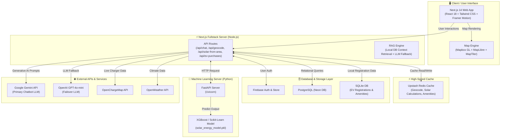

# ⚡ InfraCharge – Intelligent EV Charging Infrastructure Platform

[](https://nextjs.org/)
[](https://reactjs.org/)
[](https://www.typescriptlang.org/)
[](https://tailwindcss.com/)
[](https://firebase.google.com/)
[](https://www.postgresql.org/)
[](https://www.python.org/)
[](https://fastapi.tiangolo.com/)
[](https://scikit-learn.org/)
[](https://www.mapbox.com/)
[](https://www.framer.com/motion/)

InfraCharge is a high-performance, data-driven platform designed to revolutionize EV mobility. It empowers EV users to find reliable charging stations instantly and provides infrastructure planners with AI-backed insights for optimal station deployment.

---

## 📸 Project Showcase

### 🔍 Smart Charging Locator
Find the nearest charging stations with real-time occupancy and amenity insights.
### 🔍 Smart Charging Locator

Find the nearest charging stations with real-time occupancy and amenity insights.

### 🧭 Intelligent Route Planner

Navigate worry-free with battery-aware routing and optimized charging stops.

### 🧠 AI Infrastructure Engine

Identify high-demand zones using geospatial analysis and AI logic.


## 🚀 What Problem Does It Solve?

EV adoption is skyrocketing, but infrastructure remains fragmented. InfraCharge bridges this gap:

- **For Users**: Eliminates "Range Anxiety" through precision routing and real-time station availability.
- **For Planners**: Replaces guesswork with data-backed suggestions for new station deployment.
- **For Cities**: Supports sustainable urban planning by identifying underserved transport corridors.
- **For Planet**: Encourages green travel through transparent CO₂ impact comparisons.

---

## ✨ Core Features

### 1. Smart Station Locator
- **Auto-location**: Detects your position for instant results.
- **Amenity Filters**: Find stations near cafes, restaurants, or malls.
- **Rich Data**: Detailed pricing, power ratings, and charging standards.

### 2. AI Infrastructure Planning Engine
- **Demand Clustering**: Highlights zones with high traffic but low charger density.
- **ROI Analytics**: Helps businesses plan investments based on vehicle movement data.
- **Gap Analysis**: Visualizes critical holes in the existing charging network.

### 3. Smart EV Route Planner
- **Battery-Aware**: Suggests routes based on your vehicle's specific range.
- **Weather Integration**: Adjusts range predictions based on real-time climate data.
- **Multi-Stop Optimization**: Calculates the most efficient charging stops for long-haul trips.

### 4. CO₂ Impact Dashboard
- **Compare & Contrast**: Visualizes emissions saved compared to traditional fuel vehicles.
- **Sustainability Tracking**: Motivates users by showcasing their contribution to a cleaner environment.

---

## 🛠 Tech Stack

### Frontend & UI
- **Framework**: [Next.js 14](https://nextjs.org/) (App Router)
- **Styling**: [Tailwind CSS](https://tailwindcss.com/)
- **Animations**: [Framer Motion](https://www.framer.com/motion/)
- **Icons**: [Lucide React](https://lucide.dev/)

### Mapping & Geospatial
- **APIs**: Mapbox GL, MapTiler, OpenChargeMap
- **Georeferencing**: Geofire-common for spatial queries.

### Backend & Data
- **Auth & Database**: [Firebase](https://firebase.google.com/)
- **Relational Data**: PostgreSQL (Neon DB) / SQLite
- **ML Engine**: Python-based Demand Prediction Server

---

## 🏗️ Architecture Overview



### Layer Breakdown
- **Frontend Layer**: Built with **Next.js 14 App Router**, **React 18**, **Tailwind CSS**, and **Framer Motion** for a responsive, dark-mode UI.
- **Mapping Engine**: Integrates **Mapbox GL**, **MapLibre**, and **MapTiler** for geospatial rendering, route planning, and location pins.
- **Caching Layer**: **Upstash Redis** provides sub-millisecond RAM caching for geocoding, solar plant analysis, and amenity search.
- **RAG & GenAI Engine**: Uses a **Hybrid Retrieval-Augmented Generation (RAG)** architecture with **Google Gemini** (Primary) and **OpenAI GPT-4o-mini** (Failover).
- **ML Prediction Server**: A dedicated **Python FastAPI** microservice hosting an **XGBoost / Scikit-Learn** model for solar & energy capability analysis.
- **Database Layer**: **Firebase** for authentication, **PostgreSQL (Neon DB)** for core operational data, and **SQLite** for EV registration analytics.


---
 
 ## ⚙️ Getting Started
 
 ### Prerequisites
 - **Node.js**: v18 or higher
 - **Python**: v3.10 or higher (for ML Server)
 - **Package Manager**: npm or yarn
 - **Firebase**: An active Project setup
 
 ### Installation
 1. **Frontend Dependencies**
    ```bash
    npm install
    ```
 
 2. **ML Server Setup (Optional)**
    ```bash
    cd ml-server
    pip install -r requirements.txt
    python solar_weather_api.py
    ```
 
 3. **Environment Setup**
    Create a `.env.local` file in the root directory and add the template keys provided in our system documentation.
 
 4. **Run the development server**
    ```bash
    cd ..
    npm run dev
    ```
    Open [http://localhost:3000](http://localhost:3000) to view the application.

---

## 🔮 Future Improvements

- **Real-time charger booking system**: Directly reserve spots through the platform.
- **Mobile app version (React Native)**: Bringing InfraCharge to andriod and iOS.
- **Advanced ML model**: More granular demand prediction using local traffic APIs.
- **OEM Integration**: Direct connectivity with EV manufacturers' vehicle APIs.

---

## 👨‍💻 Author

**Dhanraj Kumar**  
*Passionate about building practical AI solutions for sustainability and mobility.*

---

## 📊 Real-World Impact
InfraCharge aims to contribute to **Faster EV Adoption**, **Smarter Infrastructure Investment**, and **Sustainable Smart City Planning**. Join us in shaping the future of electric mobility! 🚀
